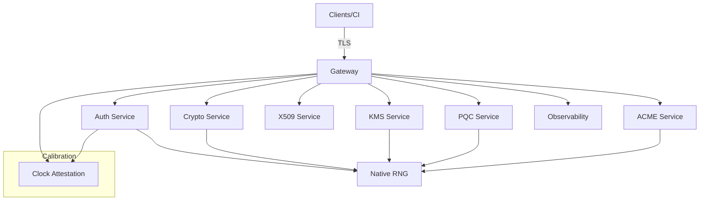

# Aunsorm Cryptographic Security Platform

## Project Description
Aunsorm is a zero-trust cryptographic security platform that unifies gateway, authentication, post-quantum cryptography (PQC), certificate management, and secure key lifecycle operations. The platform is built for regulated environments that require deterministic entropy handling, calibrated time attestations, and consistent security guarantees across microservices.

## Core Features
- End-to-end cryptographic services (JWT/OAuth2, KMS, X.509, ACME) exposed through a single gateway.
- Native entropy pipeline powered by **AunsormNativeRng** with calibrated seeding and reproducible testing flows.
- PQC coverage with ML-KEM key encapsulation and SLH-DSA / ML-DSA signature families.
- Clock attestation and calibration workflow to mitigate replay and skew-based attacks.
- Hardened deployment defaults with port isolation and containerized runtime profiles.

### Architecture Diagram


## Quick Start
### Docker
1. Ensure Docker and Docker Compose are installed.
2. Start the full stack:
   ```bash
   docker compose up --build
   ```
3. Start only the stack you need (microservice-based deployment):
   ```bash
   # Auth only (+ required RNG foundation)
   HOST=<HOST> docker compose -f docker/compose.auth-stack.yaml up --build

   # Identity bundle (auth/x509/kms/mdm/id/acme + required RNG)
   HOST=<HOST> docker compose -f docker/compose.identity-stack.yaml up --build

   # Crypto bundle (crypto/pqc + required RNG)
   HOST=<HOST> docker compose -f docker/compose.crypto-stack.yaml up --build
   ```
4. Gateway will be reachable on `http://<HOST>:50010` (replace `<HOST>` with your deployment host; see port map below for service bindings).

### CLI
Use the CLI against a running stack:
```bash
cargo run -p aunsorm-cli -- jwt verify --token <token> --format json
```
Set `AUNSORM_SERVER_URL` or `HOST` in `.env` to point the CLI to a non-default deployment.

Example `.env` override:
```bash
HOST=<HOST>
AUNSORM_SERVER_URL=http://<HOST>:50010
```
Prefer setting `HOST` so deployments can override the target without hardcoding `localhost` into scripts or configs.

### Validation
Run the full quality gate suite before committing changes:
```bash
cargo fmt --all
cargo clippy --all-targets --all-features
cargo test --all-features
cargo deny check
cargo audit
```
Ensure the `git` CLI is available so `cargo deny check` can fetch the advisory database via its git fallback in restricted network environments.

## Service List & Ports
| Service | Port | Notes |
| --- | --- | --- |
| Gateway | 50010 | Public entrypoint routing to all services |
| Auth Service | 50011 | JWT/OAuth2 flows with PKCE and calibrated JTI enforcement |
| Crypto Service | 50012 | Core cryptographic primitives and entropy services |
| X509 Service | 50013 | Certificate issuance and verification |
| KMS Service | 50014 | Key storage, rotation, and attestation-enforced access |
| MDM Service | 50015 | Device enrollment and policy application |
| ID Service | 50016 | Identity documents and claims binding |
| ACME Service | 50017 | ACME account and order management |
| PQC Service | 50018 | ML-KEM and SLH-DSA / ML-DSA operations |
| RNG Service | 50019 | Native RNG exposure for internal components |
| Blockchain Service | 50020 | Ledger anchoring and notarization |
| E2EE Service | 50021 | End-to-end encryption helpers |
| Metrics Service | 50022 | Observability and health aggregation |
| CLI Gateway | 50023 | CLI-dedicated ingress for automation |

## Endpoint Tree & Health Signals
- ✅ **Gateway** (`:50010` → `/health`): routes public traffic to all backend services and fronts calibration checks.
  - ✅ **Auth Service** (`:50011` → `/health`): JWT/OAuth2 flows with strict JTI enforcement.
  - ✅ **Crypto Service** (`:50012` → `/health`): Core cryptographic primitives.
  - ✅ **X509 Service** (`:50013` → `/health`): Certificate issuance and verification.
  - ✅ **KMS Service** (`:50014` → `/health`): Key lifecycle management with attestation gating.
  - ✅ **MDM Service** (`:50015` → `/health`): Device enrollment and policy application.
  - ✅ **ID Service** (`:50016` → `/health`): Identity binding and claims issuance.
  - 🚧 **ACME Service** (`:50017` → `/health`): ACME account/order flows (in development).
  - 🚧 **PQC Service** (`:50018` → `/health`): ML-KEM and SLH-DSA / ML-DSA endpoints (in development).
  - ⚠️ **RNG Service** (`:50019` → `/health`): Deprecated HTTP RNG exposure; use `AunsormNativeRng` in crates.
  - 🚧 **Blockchain Service** (`:50020` → `/health`): DID registry proof-of-concept for ledger anchoring.
  - 🚧 **E2EE Service** (`:50021` → `/health`): End-to-end encryption helpers (in development).
  - ✅ **Metrics Service** (`:50022` → `/health`): Prometheus metrics aggregation and health aggregation.
- ✅ **CLI Gateway** (`:50023` → `/health`): Dedicated ingress for automation and CLI flows.
- 📋 **Documentation surfaces**: OpenAPI spec server (`:50024`) and Redoc UI (`:50025`) remain reserved for spec delivery.

## API Versioning Transition
- **Current state (v0.5.x):** Primary routes are served as unversioned paths (for example `/oauth/token` and `/security/jwt-verify`) to preserve compatibility with existing clients.
- **Versioned compatibility:** `/v1/...` aliases are now available for active gateway/service endpoints alongside unversioned routes.
- **Target state (tracked in `PROD_PLAN.md`):** Path-based versioning (`/v1/...`, then `/v2/...`) will become the canonical contract as implementation work for API versioning is completed.
- **Client guidance:** Treat unversioned routes as compatibility paths and prepare integrations to follow versioned prefixes once they are announced in release notes.

## Security Guarantees
- **Deterministic entropy**: All cryptographic random generation uses `AunsormNativeRng`; OS RNG is only allowed for bootstrapping entropy.
- **Replay resistance**: Clock attestation with strict max-age windows and calibration fingerprints gates every time-sensitive operation.
- **Strict transport**: TLS-first posture with explicit `Content-Type` and structured errors across services.
- **Memory hygiene**: Secrets and key materials rely on zeroization strategies and strict backend interfaces.

## Native RNG Compliance
`AunsormNativeRng` is the mandated RNG for all crates and services. Implementations must:
- Seed from approved entropy sources once during bootstrap.
- Reuse the RNG instance per request flow to avoid cross-contamination.
- Be wired into tests and examples (no `rand::thread_rng`, `OsRng`, or HTTP randomness sources).

## PQC Support
- **ML-KEM**: Key encapsulation available through the PQC service and crates, aligned with current NIST recommendations.
- **SLH-DSA / ML-DSA**: Signature generation and verification with strict-mode enforcement; unsupported algorithms fail fast.

## Calibration Workflow
1. Obtain a signed clock attestation from the configured authority.
2. Validate fingerprint via `AUNSORM_CALIBRATION_FINGERPRINT` and enforce `AUNSORM_CLOCK_MAX_AGE_SECS` (≤30s in production).
3. Optionally enable refresh workers with `AUNSORM_CLOCK_REFRESH_URL` and `AUNSORM_CLOCK_REFRESH_INTERVAL_SECS`.
4. Monitor `/health` responses for `clock.status` and `ageMs` to detect drift early.

## Documentation
- Architecture: `docs/architecture/`
- Security & RNG: `docs/security/`
- Production readiness plan: `PROD_PLAN.md`
- Contribution workflow: PR descriptions must reference a `PROD_PLAN.md` task (see `CONTRIBUTING.md`)
- Deployment guides: `docs/deployment/`
- API references: `docs/api/` and OpenAPI source specs in `openapi/`
- Hosted API docs (HOST override aware):
  - OpenAPI index: `http://${HOST:-localhost}:50024/`
  - Swagger UI: `http://${HOST:-localhost}:8080/`
  - Redoc UI: `http://${HOST:-localhost}:50025/`

## License
Licensed under the [Apache 2.0 License](LICENSE).
