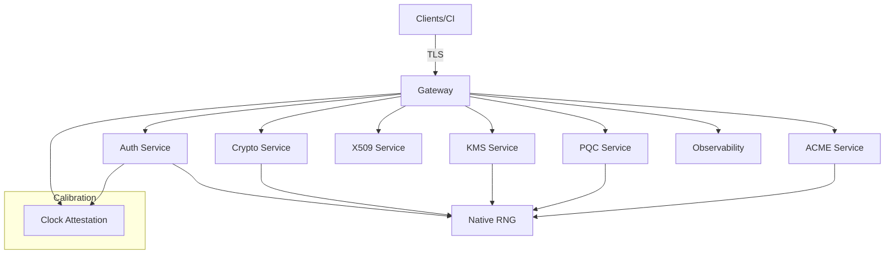

# Aunsorm Cryptographic Security Platform

## Project Description
Aunsorm is a zero-trust cryptographic security platform that unifies gateway, authentication, post-quantum cryptography (PQC), certificate management, and secure key lifecycle operations. The platform is built for regulated environments that require deterministic entropy handling, calibrated time attestations, and consistent security guarantees across microservices.

## Core Features
- End-to-end cryptographic services (JWT/OAuth2, KMS, X.509, ACME) exposed through a single gateway.
- Native randomness powered by **AunsormNativeRng** with OS seeding, fast key erasure, and reproducible validation flows.
- PQC coverage with ML-KEM key encapsulation and SLH-DSA / ML-DSA signature families.
- Clock attestation and calibration workflow to mitigate replay and skew-based attacks.
- Hardened deployment defaults with port isolation and containerized runtime profiles.

Offline research and diagnostics: [SASRL integration evidence](docs/sasrl-aunsorm-integration.md)
documents the bounded cardinal-Mellin experiment tool and Native RNG spectral
regressions, including their conditional/experimental status and verification commands.
The zeta laboratory validates an optional complete analytic-model declaration
and rejects contradictory or unknown metadata before estimating. Legacy input
is labelled implicit zeta; metadata assertions do not verify the supplied zeros.
The same report covers bounded PCM sinc-Gaussian conversion experiments and decoded
telemetry cadence checks that reject gaps/jitter before an exact-grid FFT.
The experimental streaming PCM tool preserves a global integer sample clock,
bounds history/cache/work, rejects discontinuous offsets and requires an explicit
EOF sample count. Synthetic chunk controls match offline samples and WAV bytes;
authenticated live QUIC, throughput and backpressure validation remain open.
Bounded host benchmarks now measure the PCM laboratory and a modelled worker
queue. Interior-buffer optimization preserves exact output hashes, but the
refined Python profile still exceeds a 10 ms processing cadence on this host.
Independent two-mode QR and bounded 2..8-mode matrix diagnostics measure how
clustered frequencies amplify small perturbations, with explicit unresolved and
nonconverged statuses. They support the conditioning caution without recovering
missing telemetry or treating spectral estimates as security evidence.
Optional decoded-gauge conditioning now uses actual observed millisecond
positions, with integer epoch subtraction and explicit 512-position limits.
Synthetic thinning/jitter controls expose aliasing that a nominal grid hides;
the diagnostic leaves gaps unfilled and preserves FFT eligibility checks.
An independent public elliptic-curve point-count oracle verifies local Euler
reference values and normalization before any curve-specific spectral experiment.

HTTP/3 capability discovery: `GET /http3/capabilities` — 🚧 experimental feature;
96 kHz PCM datagram validation and exact complete-frame helpers are documented in
[server instructions](crates/server/README.md) and [auth OpenAPI](openapi/auth-service.yaml).
The PCM split API can reserve caller-owned envelope overhead; real AES-GCM tests
verify wire budgets and metadata/session binding without adopting a new E2EE protocol.

KMS now rejects malformed PKCS#11 Ed25519 EC point attributes and DER
encodings using a bounded shared-source decoder. See [KMS security notes](crates/kms/README.md);
Cryptoki dependency remediation and live HSM verification remain open.

Build compatibility: the declared MSRV target remains Rust 1.76, but the current
locked Windows/all-feature graph has 29 dependencies declaring higher versions.
The SASRL tests use Rust 1.90; an actual Cargo 1.76 core-library check fails
before compilation on rayon 1.12.0 (requires 1.80), also activated through
the normal core/sysinfo dependency path. See the
[exact dependency paths](docs/research/msrv-dependency-audit.json) and open
compatibility tasks in `PROD_PLAN.md` before claiming MSRV compliance.
=======
### Entropy Extraction Research

The offline [Toeplitz reference](research/toeplitz/README.md) implements universal
hashing with an explicit min-entropy output budget, exact finite tests and a
reproducible synthetic experiment. Physical-source certification and independent
seed design are required before production integration; no RNG strength increase
is claimed by the synthetic experiment.

### Arithmetic Research

The offline [SASRL research tool](research/sasrl/README.md) reproduces spectral
arithmetic experiments with exact sieve comparisons and recorded data/code
hashes. It is an experimental reconstruction tool; it does not supply entropy
or change native RNG and key-generation behavior.

### Architecture Diagram

```mermaid
graph TD
    Client[Clients/CI] -->|TLS| Gateway
    Gateway --> Auth[Auth Service]
    Gateway --> Crypto[Crypto Service]
    Gateway --> KMS[KMS Service]
    Gateway --> X509[X509 Service]
    Gateway --> PQC[PQC Service]
    Gateway --> ACME[ACME Service]
    Gateway --> Metrics[Observability]
    Auth --> RNG[Native RNG]
    Crypto --> RNG
    KMS --> RNG
    PQC --> RNG
    ACME --> RNG
    subgraph Calibration
        Clock[Clock Attestation]
    end
    Gateway --> Clock
    Auth --> Clock
```

## Quick Start
### Docker
1. Ensure Docker and Docker Compose are installed.
2. Start the full stack:
   ```bash
   docker compose up --build
   ```
3. Start only the stack you need (microservice-based deployment):
   ```bash
   # Auth only (+ required RNG foundation)
   HOST=<HOST> docker compose -f docker/compose.auth-stack.yaml up --build

   # Identity bundle (auth/x509/kms/mdm/id/acme + required RNG)
   HOST=<HOST> docker compose -f docker/compose.identity-stack.yaml up --build

   # Crypto bundle (crypto/pqc + required RNG)
   HOST=<HOST> docker compose -f docker/compose.crypto-stack.yaml up --build
   ```
4. Gateway will be reachable on `http://<HOST>:50010` (replace `<HOST>` with your deployment host; see port map below for service bindings).

### CLI
Use the CLI against a running stack:
```bash
cargo run -p aunsorm-cli -- jwt verify --token <token> --format json
```
Set `AUNSORM_SERVER_URL` or `HOST` in `.env` to point the CLI to a non-default deployment.

Example `.env` override:
```bash
HOST=<HOST>
AUNSORM_SERVER_URL=http://<HOST>:50010
```
Prefer setting `HOST` so deployments can override the target without hardcoding `localhost` into scripts or configs.

### Validation
Run the full quality gate suite before committing changes:
```bash
cargo fmt --all
cargo clippy --all-targets --all-features
cargo test --all-features
cargo deny check
cargo audit
```
Ensure the `git` CLI is available so `cargo deny check` can fetch the advisory database via its git fallback in restricted network environments.

## Service List & Ports
| Service | Port | Notes |
| --- | --- | --- |
| Gateway | 50010 | Public entrypoint routing to all services |
| Auth Service | 50011 | JWT/OAuth2 flows with PKCE and calibrated JTI enforcement |
| Crypto Service | 50012 | Core cryptographic primitives and entropy services |
| X509 Service | 50013 | Certificate issuance and verification |
| KMS Service | 50014 | Key storage, rotation, and attestation-enforced access |
| MDM Service | 50015 | Device enrollment and policy application |
| ID Service | 50016 | Identity documents and claims binding |
| ACME Service | 50017 | ACME account and order management |
| PQC Service | 50018 | ML-KEM and SLH-DSA / ML-DSA operations |
| RNG Service | 50019 | Native RNG exposure for internal components |
| Blockchain Service | 50020 | Ledger anchoring and notarization |
| E2EE Service | 50021 | End-to-end encryption helpers |
| Metrics Service | 50022 | Observability and health aggregation |
| CLI Gateway | 50023 | CLI-dedicated ingress for automation |

## Endpoint Tree & Health Signals
- ✅ **Gateway** (`:50010` → `/health`): routes public traffic to all backend services and fronts calibration checks.
  - ✅ **Auth Service** (`:50011` → `/health`): JWT/OAuth2 flows with strict JTI enforcement.
  - ✅ **Crypto Service** (`:50012` → `/health`): Core cryptographic primitives.
  - ✅ **X509 Service** (`:50013` → `/health`): Certificate issuance and verification.
  - ✅ **KMS Service** (`:50014` → `/health`): Key lifecycle management with attestation gating.
  - ✅ **MDM Service** (`:50015` → `/health`): Device enrollment and policy application.
  - ✅ **ID Service** (`:50016` → `/health`): Identity binding and claims issuance.
  - 🚧 **ACME Service** (`:50017` → `/health`): ACME account/order flows (in development).
  - 🚧 **PQC Service** (`:50018` → `/health`): ML-KEM and SLH-DSA / ML-DSA endpoints (in development).
  - ⚠️ **RNG Service** (`:50019` → `/health`): Deprecated HTTP RNG exposure; use `AunsormNativeRng` in crates.
  - 🚧 **Blockchain Service** (`:50020` → `/health`): DID registry proof-of-concept for ledger anchoring.
  - 🚧 **E2EE Service** (`:50021` → `/health`): End-to-end encryption helpers (in development).
  - ✅ **Metrics Service** (`:50022` → `/health`): Prometheus metrics aggregation and health aggregation.
- ✅ **CLI Gateway** (`:50023` → `/health`): Dedicated ingress for automation and CLI flows.
- 📋 **Documentation surfaces**: OpenAPI spec server (`:50024`) and Redoc UI (`:50025`) remain reserved for spec delivery.

## API Versioning Transition
- **Current state (v0.5.x):** Primary routes are served as unversioned paths (for example `/oauth/token` and `/security/jwt-verify`) to preserve compatibility with existing clients.
- **Password hashing:** Dedicated user-account password endpoints are available at `/security/password-hash` and `/security/password-verify`.
- **Application sessions:** First-party session key endpoints are available at `/sessions` and `/sessions/{sessionId}/keys`; HMAC helpers for these sessions are available at `/security/hmac-sign` and `/security/hmac-verify`.
- **Binary encryption:** AES-256-GCM helper endpoints are available at `/security/encrypt` and `/security/decrypt`; HD audio datagram clients use this surface with compact binary envelopes while preserving existing session/key rotation flows.
- **Versioned compatibility:** `/v1/...` aliases are now available for active gateway/service endpoints alongside unversioned routes.
- **Target state (tracked in `PROD_PLAN.md`):** Path-based versioning (`/v1/...`, then `/v2/...`) will become the canonical contract as implementation work for API versioning is completed.
- **Client guidance:** Treat unversioned routes as compatibility paths and prepare integrations to follow versioned prefixes once they are announced in release notes.

## Security Guarantees
- **Native randomness**: All cryptographic random generation uses `AunsormNativeRng`; OS RNG access is confined to its seeding and reseeding.
- **Replay resistance**: Clock attestation with strict max-age windows and calibration fingerprints gates every time-sensitive operation.
- **Strict transport**: TLS-first posture with explicit `Content-Type` and structured errors across services.
- **Memory hygiene**: Secrets and key materials rely on zeroization strategies and strict backend interfaces.

## Native RNG Compliance
`AunsormNativeRng` is the mandated RNG for all crates and services. Implementations must:
- Seed at startup and reseed from OS randomness after 64 KiB of generated output or a PID change.
- Call `reseed()` before using an RNG restored from a same-PID snapshot.
- Use `try_new()`/`try_fill_bytes()` to handle OS failures; infallible methods panic on failure.
- Redact state in Debug output and erase consumed buffered bytes. See [ADR 0008](docs/architecture/adr/0008-native-rng-state-hardening.md).
- Reuse the RNG instance per request flow to avoid cross-contamination.
- Be wired into tests and examples (no `rand::thread_rng`, `OsRng`, or HTTP randomness sources).

## PQC Support
- **ML-KEM**: Key encapsulation available through the PQC service and crates, aligned with current NIST recommendations.
- **SLH-DSA / ML-DSA**: Signature generation and verification with strict-mode enforcement; unsupported algorithms fail fast.

## Calibration Workflow
1. Obtain a signed clock attestation from the configured authority.
2. Validate fingerprint via `AUNSORM_CALIBRATION_FINGERPRINT` and enforce `AUNSORM_CLOCK_MAX_AGE_SECS` (≤30s in production).
3. Optionally enable refresh workers with `AUNSORM_CLOCK_REFRESH_URL` and `AUNSORM_CLOCK_REFRESH_INTERVAL_SECS`.
4. Monitor `/health` responses for `clock.status` and `ageMs` to detect drift early.

## Documentation
- Architecture: `docs/architecture/`
- Security & RNG: `docs/security/`
- Production readiness plan: `PROD_PLAN.md`
- Contribution workflow: PR descriptions must reference a `PROD_PLAN.md` task (see `CONTRIBUTING.md`)
- Deployment guides: `docs/deployment/`
- API references: `docs/api/`, generated OpenAPI catalog artifacts (`docs/api/openapi-catalog.*`), and OpenAPI source specs in `openapi/`
- Hosted API docs (HOST override aware):
  - OpenAPI index: `http://${HOST:-localhost}:50024/`
  - Swagger UI: `http://${HOST:-localhost}:8080/`
  - Redoc UI: `http://${HOST:-localhost}:50025/`

## License
Licensed under the [Apache 2.0 License](LICENSE).
