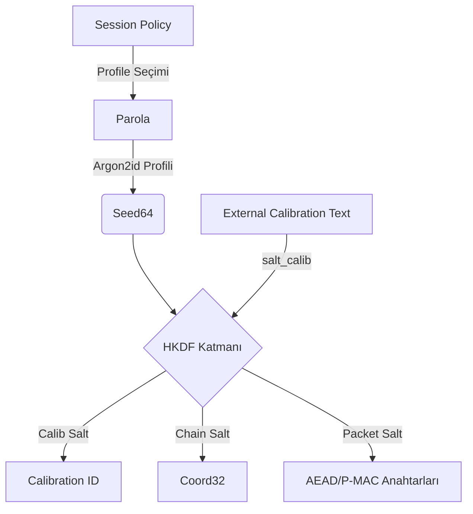
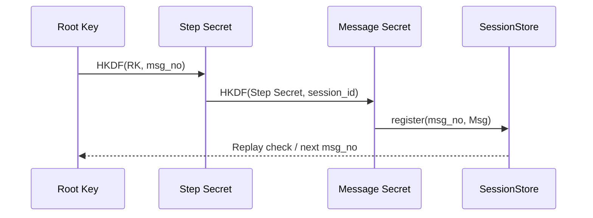

# Kalibrasyon ve Ratchet Temelleri

Aunsorm mimarisi, oturum anahtarlarının yalnızca parola türevine değil, dışarıdan
beslenen kalibrasyon metni ve deterministik ratchet ilerlemesine bağlı olmasını
zorunlu kılar. Bu sayede hem kimlik bağlama hem de ilerleyiş koruması tek
kaynakta denetlenir.

## Dış Kalibrasyon Bağlamı

Her oturum, kalibrasyon koordinatlarını üç tuz ailesi ile ilişkilendirir:

- **Parola Tuzu (`salt_pwd`)** — Kullanıcı tarafından sağlanan sırları Argon2id
  üzerinden sertleştirir.
- **Kalibrasyon Tuzu (`salt_calib`)** — Dış sistem tarafından zorunlu kılınan ve
  `calib_from_text` ile kalibrasyon kimliğine dönüştürülen bağlamı sabitler.
- **Zincir Tuzu (`salt_chain`)** — Ratchet ilerleyişine özel deterministik tuz
  üretimini besler.

Bu girdiler `derive_seed64_and_pdk` fonksiyonunda birleşerek hem 64 baytlık
çekirdek tohumunu hem de paket anahtarlama materyalini üretir.



Kalibrasyon kimliği (`calib_id`) ve koordinat özeti (`coord_digest`), paket
başlıklarının doğrulama katmanına yerleştirilerek sunucu tarafında kayıt altına
alınır. Strict kipte bu alanlar eksikse işlem reddedilir.

## Ratchet İlerleyişi

Ratchet, her mesaj için hem adım anahtarını hem de mesaj anahtarını türetir. Bu
kademeli yapı, tekrar saldırılarını önlerken oturum anahtarlarının geçmişten
kopuk olmasını sağlar.



- `SessionStore::register`, `msg_no` tekilliğini garanti eder ve hatalı
  sıralamaları reddeder.
- `coord32_derive`, ratchet koordinatlarının deterministik ilerleyişini sağlar.
- Strict kipte `msg_no` atlamaları kabul edilmez; istemci yeniden senkronize
  olana kadar oturum kilitlenir.

## Denetim Noktaları

1. **Kalibrasyon İzlenebilirliği:** Her `calib_id`, `SessionMetadata` kaydında ve
   oturum günlüklerinde tutulur.
2. **Anahtar Sıfırlama:** Ratchet sıfırlama talepleri, aynı kalibrasyon kimliği
   ile eşleşen yeni bir `seed64` üretmek zorundadır.
3. **Test Kapsamı:** `tests/tests/hacker_pen_test.rs` ratchet tekrar denemelerini
   yakalar; `tests/tests/soak.rs` ise uzun süreli `session_ratchet_roundtrip`
   senaryolarıyla kalibrasyon zorlamalarını doğrular.

## Kalibrasyon Bağlama Zinciri

Aşağıdaki adımlar kalibrasyon bağlamının nasıl oluşturulacağını, CLI çıktıları
ile sunucu doğrulamasının nasıl senkronize tutulacağını gösterir:

1. **Kurumsal tuzu seç:** En az 16 baytlık rastgele değeri Base64 olarak
   yayınlayın. Örnek: `V2VBcmVLdXQuZXU=`.
2. **CLI ile kalibrasyonu incele:**

   ```bash
   aunsorm-cli calib inspect \
     --org-salt V2VBcmVLdXQuZXU= \
     --calib-text "Neudzulab | Prod | 2025-08" \
     --format json
   ```

   Çıktıdaki `calibration_id`, `fingerprint` (Base64) ve `fingerprint_hex`
   alanları hem istemci tarafındaki beklenen parmak izini hem de sunucu
   yapılandırmasını besler.
3. **Yerel beklentiyi kilitle:** CLI doğrulamasını beklenen fingerprint ile
   çalıştırarak operatör hatalarını yakalayın.

   ```bash
   aunsorm-cli calib verify \
     --org-salt V2VBcmVLdXQuZXU= \
     --calib-text "Neudzulab | Prod | 2025-08" \
     --expect-fingerprint-hex 671023bc1061591b72923f7f9f97abb04fe3ab3767bb8b21895912995d1a3298
   ```

   Komut hata kodu 0 dönerse fingerprint eşleşmiştir; farklıysa CLI ayrıntılı
   raporu stderr'e yazar.
4. **Sunucu yapılandırması:** `AUNSORM_CALIBRATION_FINGERPRINT` ortam değişkeni
   CLI çıktısındaki `fingerprint_hex` değeriyle aynı olmalıdır. Strict kipte bu
   değer eşleşmezse istek 422 ile reddedilir.
5. **Sunucu doğrulaması:** Aşağıdaki uçlar CLI ile aynı Base64 org tuzu ve metin
   girdilerini kabul eder, bu sayede tam uçtan uca bağlama sağlanır.

## Sunucu Kalibrasyon Uçları

Aunsorm sunucusu, CLI çıktılarıyla birebir uyumlu JSON döndüren iki uç sağlar:

- `POST /calib/inspect` — İstek gövdesinde `org_salt` (Base64) ve `calib_text`
  alanlarını bekler. Yanıtta kalibrasyon kimliği, normalize metin, parmak izi
  (Base64/hex) ve beş aralık özetini döndürür. Bu yapı `aunsorm-cli calib
  inspect --format json` çıktısıyla aynı alanlara sahiptir.

  ```bash
  curl -sS http://${HOST:-localhost}:8080/calib/inspect \
    -H 'Content-Type: application/json' \
    -d '{
          "org_salt": "V2VBcmVLdXQuZXU=",
          "calib_text": "Neudzulab | Prod | 2025-08"
        }'
  ```

  Örnek yanıt:

  ```json
  {
    "calibration_id": "Zi2wzqLHL-rqD4e5jxD-VSWi",
    "note_text": "Neudzulab | Prod | 2025-08",
    "alpha_long": 1340,
    "alpha_short": 1323,
    "beta_long": 4990,
    "beta_short": 1396,
    "tau": 579,
    "fingerprint": "ZxAjvBBhWRtykj9_n5ersE_jqzdnu4shiVkSmV0aMpg",
    "fingerprint_hex": "671023bc1061591b72923f7f9f97abb04fe3ab3767bb8b21895912995d1a3298",
    "ranges": [
      { "start": 1413, "end": 2870, "step": 47 },
      { "start": 3440, "end": 5441, "step": 23 },
      { "start": 2289, "end": 3929, "step": 164 },
      { "start": 2153, "end": 3531, "step": 26 },
      { "start": 351, "end": 1674, "step": 189 }
    ]
  }
  ```
- `POST /calib/verify` — Aynı girdi alanlarını kullanarak kalibrasyon parmak
  izini sunucunun yapılandırılmış `AUNSORM_CALIBRATION_FINGERPRINT` değeriyle
  kıyaslar. Yanıt `expectations`/`results` alanlarını içerir; Strict kip aktifse
  eşleşmeyen parmak izleri HTTP 422 durum kodu ve başarısız sonuç bayraklarıyla
  döner. Bu durumda sistem ayrıca `AuditEvent::Failure` telemetri girdisi
  yayımlar ve denetim izlerini güncel tutar. Strict kip devre dışıysa yanıt 200
  kalır ancak sonuç alanı `false` olarak işaretlenir.

  ```bash
  curl -sS -w '\nHTTP %{http_code}\n' http://${HOST:-localhost}:8080/calib/verify \
    -H 'Content-Type: application/json' \
    -d '{
          "org_salt": "V2VBcmVLdXQuZXU=",
          "calib_text": "Neudzulab | Prod | 2025-08"
        }'
  ```

  Başarılı bir eşleşme `HTTP 200` ve `results.fingerprint_hex=true` döndürür.
  Strict kipte uyuşmazlık yaşanırsa `HTTP 422` ile `results.fingerprint_hex=false`
  gelir ve telemetriye başarısızlık olayı yazılır.

  Başarılı yanıt örneği:

  ```json
  {
    "calibration_id": "Zi2wzqLHL-rqD4e5jxD-VSWi",
    "fingerprint_b64": "ZxAjvBBhWRtykj9_n5ersE_jqzdnu4shiVkSmV0aMpg",
    "fingerprint_hex": "671023bc1061591b72923f7f9f97abb04fe3ab3767bb8b21895912995d1a3298",
    "expectations": {
      "id": null,
      "fingerprint_b64": "ZxAjvBBhWRtykj9_n5ersE_jqzdnu4shiVkSmV0aMpg",
      "fingerprint_hex": "671023bc1061591b72923f7f9f97abb04fe3ab3767bb8b21895912995d1a3298"
    },
    "results": {
      "id": null,
      "fingerprint_b64": true,
      "fingerprint_hex": true
    }
  }
  ```

Her iki uç da CLI'ya eşlik eden denetim kanıtı zincirini (`audit_proof`) baz
alarak istemcinin doğru kalibrasyon bağlamı ile konuştuğunu doğrular.
