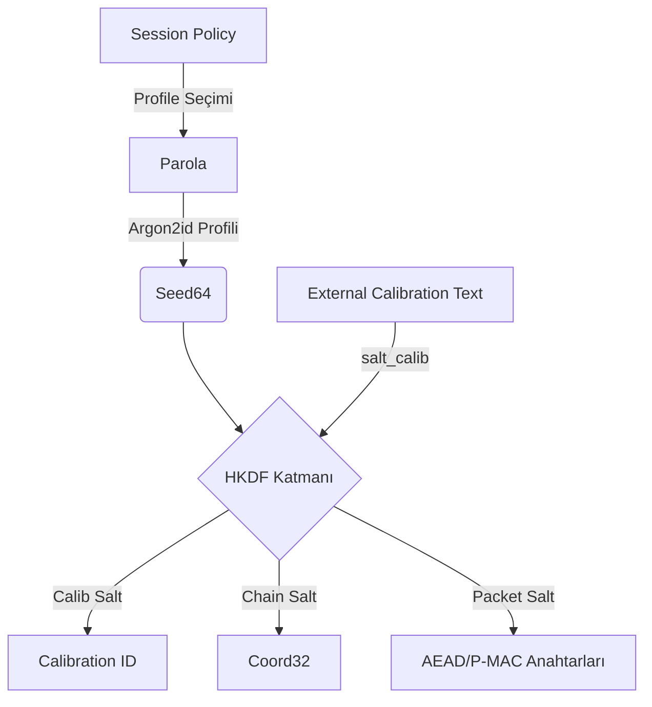
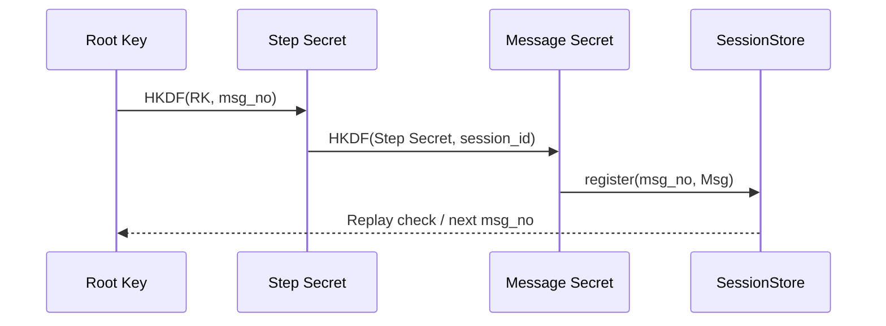

# Kalibrasyon ve Ratchet Temelleri

Aunsorm mimarisi, oturum anahtarlarının yalnızca parola türevine değil, dışarıdan
beslenen kalibrasyon metni ve deterministik ratchet ilerlemesine bağlı olmasını
zorunlu kılar. Bu sayede hem kimlik bağlama hem de ilerleyiş koruması tek
kaynakta denetlenir.

## Dış Kalibrasyon Bağlamı

Her oturum, kalibrasyon koordinatlarını üç tuz ailesi ile ilişkilendirir:

- **Parola Tuzu (`salt_pwd`)** — Kullanıcı tarafından sağlanan sırları Argon2id
  üzerinden sertleştirir.
- **Kalibrasyon Tuzu (`salt_calib`)** — Dış sistem tarafından zorunlu kılınan ve
  `calib_from_text` ile kalibrasyon kimliğine dönüştürülen bağlamı sabitler.
- **Zincir Tuzu (`salt_chain`)** — Ratchet ilerleyişine özel deterministik tuz
  üretimini besler.

Bu girdiler `derive_seed64_and_pdk` fonksiyonunda birleşerek hem 64 baytlık
çekirdek tohumunu hem de paket anahtarlama materyalini üretir.

Kalibrasyon kimliği (`calib_id`) ve koordinat özeti (`coord_digest`), paket
başlıklarının doğrulama katmanına yerleştirilerek sunucu tarafında kayıt altına
alınır. Strict kipte bu alanlar eksikse işlem reddedilir.

## Ratchet İlerleyişi

Ratchet, her mesaj için hem adım anahtarını hem de mesaj anahtarını türetir. Bu
kademeli yapı, tekrar saldırılarını önlerken oturum anahtarlarının geçmişten
kopuk olmasını sağlar.

- `SessionStore::register`, `msg_no` tekilliğini garanti eder ve hatalı
  sıralamaları reddeder.
- `coord32_derive`, ratchet koordinatlarının deterministik ilerleyişini sağlar.
- Strict kipte `msg_no` atlamaları kabul edilmez; istemci yeniden senkronize
  olana kadar oturum kilitlenir.

## Denetim Noktaları

1. **Kalibrasyon İzlenebilirliği:** Her `calib_id`, `SessionMetadata` kaydında ve
   oturum günlüklerinde tutulur.
2. **Anahtar Sıfırlama:** Ratchet sıfırlama talepleri, aynı kalibrasyon kimliği
   ile eşleşen yeni bir `seed64` üretmek zorundadır.
3. **Test Kapsamı:** `tests/tests/hacker_pen_test.rs` ratchet tekrar denemelerini
   yakalar; `tests/tests/soak.rs` ise uzun süreli `session_ratchet_roundtrip`
   senaryolarıyla kalibrasyon zorlamalarını doğrular.

## Sunucu Kalibrasyon Uçları

Aunsorm sunucusu, CLI çıktılarıyla birebir uyumlu JSON döndüren iki uç sağlar:

- `POST /calib/inspect` — İstek gövdesinde `org_salt` (Base64) ve `calib_text`
  alanlarını bekler. Yanıtta kalibrasyon kimliği, normalize metin, parmak izi
  (Base64/hex) ve beş aralık özetini döndürür. Bu yapı `aunsorm-cli calib
  inspect --format json` çıktısıyla aynı alanlara sahiptir.
- `POST /calib/verify` — Aynı girdi alanlarını kullanarak kalibrasyon parmak
  izini sunucunun yapılandırılmış `AUNSORM_CALIBRATION_FINGERPRINT` değeriyle
  kıyaslar. Yanıt `expectations`/`results` alanlarını içerir; Strict kip aktifse
  eşleşmeyen parmak izleri HTTP 422 durum kodu ve başarısız sonuç bayraklarıyla
  döner. Bu durumda sistem ayrıca `AuditEvent::Failure` telemetri girdisi
  yayımlar ve denetim izlerini güncel tutar. Strict kip devre dışıysa yanıt 200
  kalır ancak sonuç alanı `false` olarak işaretlenir.

Her iki uç da CLI'ya eşlik eden denetim kanıtı zincirini (`audit_proof`) baz
alarak istemcinin doğru kalibrasyon bağlamı ile konuştuğunu doğrular.
